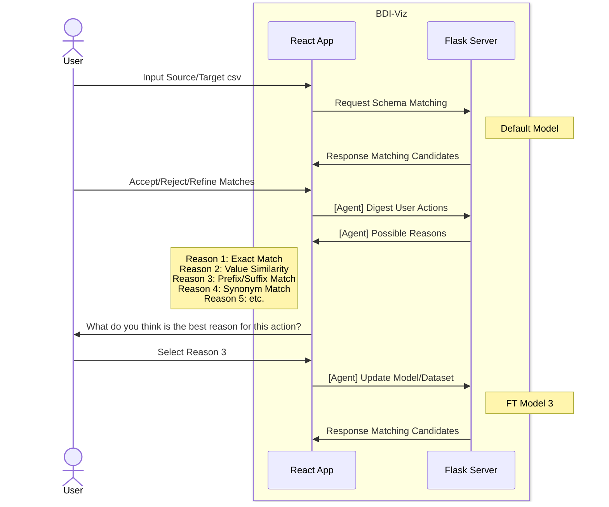

<h2 align="center">BDI-Viz-React</h2>


## Table of Contents

* [1. Environment Setup](#gear-getting-started)
* [2. Introduction](#gear-introduction)
* [3. Demo](#camera-demo)
* [4. Sequence Diagram](#gear-sequence-diagram)


## :gear: Getting Started

First, run the development server:

```bash
npm run dev
```

## :gear: Introduction

BDIViz is a powerful, interactive tool designed as an extension to [BDIKit](https://github.com/VIDA-NYU/bdi-kit) to assist biomedical researchers and domain experts in performing schema matching tasks. Built to address the challenges of matching complex biomedical datasets, BDIViz leverages a visual approach to streamline the process and enhance both speed and accuracy.

Key features of BDIViz include:

- **Interactive Heatmap** for exploring and comparing matching candidates.
- **Value Comparisons** Panel for analyzing similarities between attributes.
- **Detailed Analysis** Panel offering in-depth insights into attribute value distributions.
- **Filtering & Refinement Tools** to customize and adjust matching candidates based on datatype and similarity scores.
- **Expert-in-the-Loop Workflow** allowing users to iteratively accept, reject, or refine matches, keeping the expert in control of decision-making.

BDIViz is designed to be integrated with Python notebooks, providing a flexible and easy-to-use tool for domain-specific schema matching in biomedical research and beyond.

## :camera: Demo

[BDIViz Demo](https://drive.google.com/file/d/1eAbDicO0oXIbbVg56m3H8xdNDDsBGBLI/view?usp=drive_link)


## :gear: Sequence Diagram
